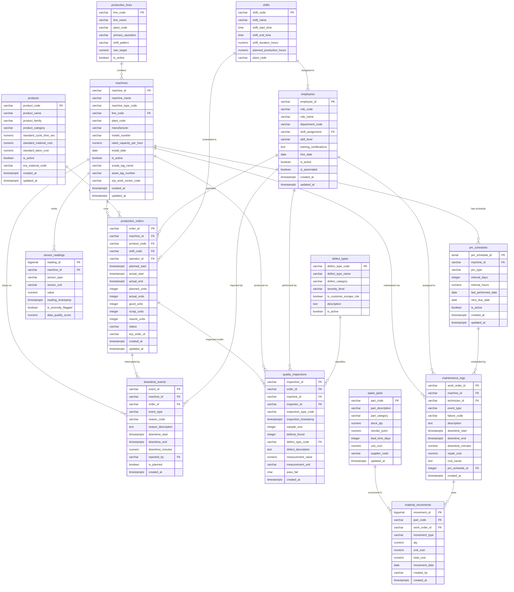

# ER Diagram — Smart Manufacturing Analytics Platform (SMAP)

**Document Version:** 1.0.0
**Last Updated:** 2026-07-22
**Status:** Approved — Complete Design Baseline
**Owner:** Lead Database Architect
**Related Documents:**
- [../DATABASE_DESIGN.md](../DATABASE_DESIGN.md)
- [DB_DATA_DICTIONARY.md](./DB_DATA_DICTIONARY.md)

---

## Table of Contents

1. [Operational Database ERD](#1-operational-database-erd)
2. [Data Warehouse Star Schema ERD](#2-data-warehouse-star-schema-erd)
3. [Diagram Notes](#3-diagram-notes)

---

## 1. Operational Database ERD

The following Mermaid ER diagram depicts all 14 entities in the SMAP operational (OLTP)
database and their relationships. The operational database is in Third Normal Form (3NF).

---

## 2. Data Warehouse Star Schema ERD

The following Mermaid ER diagram depicts the analytical warehouse star schema in the `marts` schema.
Four fact tables share seven common dimension tables.

```mermaid
erDiagram
    dim_date {
        integer date_key PK
        date full_date
        smallint day_of_week
        varchar day_name
        smallint week_of_year
        smallint month_number
        varchar month_name
        smallint quarter
        smallint year
        smallint fiscal_quarter
        smallint fiscal_year
        boolean is_weekend
        boolean is_holiday
        boolean is_working_day
    }

    dim_machine {
        serial machine_sk PK
        varchar machine_id
        varchar machine_name
        varchar machine_type_code
        varchar machine_type_name
        varchar line_code
        varchar line_name
        varchar plant_code
        numeric rated_capacity_per_hour
        boolean is_active
        numeric oee_target
        timestamptz dbt_updated_at
    }

    dim_product {
        serial product_sk PK
        varchar product_code
        varchar product_name
        varchar product_family
        varchar product_category
        numeric standard_cycle_time_sec
        numeric standard_material_cost
        boolean is_active
        timestamptz dbt_updated_at
    }

    dim_employee {
        serial employee_sk PK
        varchar employee_id
        varchar role_code
        varchar role_name
        varchar department_code
        varchar shift_assignment
        varchar skill_level
        numeric tenure_years
        boolean is_active
        boolean is_automated
        timestamptz dbt_updated_at
    }

    dim_shift {
        serial shift_sk PK
        varchar shift_code
        varchar shift_name
        time shift_start_time
        time shift_end_time
        numeric shift_duration_hours
        numeric planned_production_hours
        varchar plant_code
    }

    dim_defect_type {
        serial defect_type_sk PK
        varchar defect_type_code
        varchar defect_type_name
        varchar defect_category
        varchar severity_level
        boolean is_customer_escape_risk
        boolean is_active
        timestamptz dbt_updated_at
    }

    dim_failure_code {
        serial failure_code_sk PK
        varchar failure_code
        varchar failure_code_name
        varchar failure_category
        numeric typical_mttr_hours
        boolean is_active
        timestamptz dbt_updated_at
    }

    fct_production {
        bigserial production_sk PK
        integer date_key FK
        integer machine_sk FK
        integer product_sk FK
        integer shift_sk FK
        integer employee_sk FK
        varchar order_id
        integer planned_units
        integer actual_units
        integer good_units
        integer scrap_units
        integer rework_units
        numeric planned_duration_min
        numeric actual_duration_min
        numeric downtime_min
        numeric run_time_min
        numeric oee_availability
        numeric oee_performance
        numeric oee_quality
        numeric oee_overall
        numeric throughput_rate_per_hr
        numeric scrap_cost
        timestamptz dbt_updated_at
    }

    fct_quality_inspection {
        bigserial inspection_sk PK
        integer date_key FK
        integer machine_sk FK
        integer product_sk FK
        integer employee_sk FK
        integer defect_type_sk FK
        varchar inspection_id
        varchar order_id
        varchar inspection_type_code
        integer sample_size
        integer defects_found
        numeric defect_rate_pct
        numeric defect_rate_ppm
        char pass_fail
        numeric measurement_value
        numeric measurement_deviation
        timestamptz dbt_updated_at
    }

    fct_sensor_reading {
        bigserial sensor_sk PK
        integer date_key FK
        integer machine_sk FK
        bigint reading_id
        varchar sensor_type
        varchar sensor_unit
        numeric value
        timestamptz reading_timestamp
        boolean is_anomaly_flagged
        numeric data_quality_score
        boolean is_within_spec
        timestamptz dbt_updated_at
    }

    fct_maintenance_event {
        bigserial maintenance_sk PK
        integer date_key FK
        integer machine_sk FK
        integer employee_sk FK
        integer failure_code_sk FK
        varchar work_order_id
        varchar event_type
        boolean is_planned
        timestamptz downtime_start
        timestamptz downtime_end
        numeric downtime_minutes
        numeric mttr_minutes
        numeric repair_cost
        numeric days_since_last_failure
        numeric days_since_last_pm
        boolean pm_compliance
        timestamptz dbt_updated_at
    }

    dim_date ||--o{ fct_production : "date_key"
    dim_date ||--o{ fct_quality_inspection : "date_key"
    dim_date ||--o{ fct_sensor_reading : "date_key"
    dim_date ||--o{ fct_maintenance_event : "date_key"

    dim_machine ||--o{ fct_production : "machine_sk"
    dim_machine ||--o{ fct_quality_inspection : "machine_sk"
    dim_machine ||--o{ fct_sensor_reading : "machine_sk"
    dim_machine ||--o{ fct_maintenance_event : "machine_sk"

    dim_product ||--o{ fct_production : "product_sk"
    dim_product ||--o{ fct_quality_inspection : "product_sk"

    dim_shift ||--o{ fct_production : "shift_sk"

    dim_employee ||--o{ fct_production : "employee_sk"
    dim_employee ||--o{ fct_quality_inspection : "employee_sk"
    dim_employee ||--o{ fct_maintenance_event : "employee_sk"

    dim_defect_type ||--o{ fct_quality_inspection : "defect_type_sk"

    dim_failure_code ||--o{ fct_maintenance_event : "failure_code_sk"
```

---

## 3. Diagram Notes

### Operational DB ERD Notes

- All foreign key relationships shown are enforced at the database level as `FOREIGN KEY` constraints.
- The `sensor_readings` table connects only to `machines` — it is deliberately kept flat to minimize
  join overhead on the highest-volume table.
- The `downtime_events.order_id` FK is nullable — a machine can stop between production orders.
- The `material_movements.work_order_id` FK is nullable — supports non-maintenance inventory transactions
  (goods receipts, stock transfers).
- The `employees.shift_assignment` references `shifts.shift_code` — representing the primary shift,
  not the actual shift on any given day (actual shift coverage is in the HR shift_schedule CSV).

### Warehouse ERD Notes

- All dimension surrogate keys (-1) represent the pre-seeded "Unknown" member.
- `fct_sensor_reading` connects only to `dim_date` and `dim_machine` — sensor readings have no product,
  shift, or employee dimension. Sensor-to-production-order correlation is done in the intermediate layer
  via timestamp overlap joins, not stored in the fact table.
- `fct_production` and `fct_quality_inspection` share the same date, machine, product, and employee
  dimensions — enabling cross-fact-table analysis (e.g., OEE vs. defect rate by machine and date).
- The `fct_sensor_hourly_summary` derived table (not shown) provides hourly aggregates per machine
  per sensor type for dashboard and ML feature use. It references `dim_date` and `dim_machine` only.

---

*This ER diagram is the authoritative visual representation of the SMAP database schema.*
*Any schema change must be reflected here before implementation. Last reviewed: 2026-07-22.*
